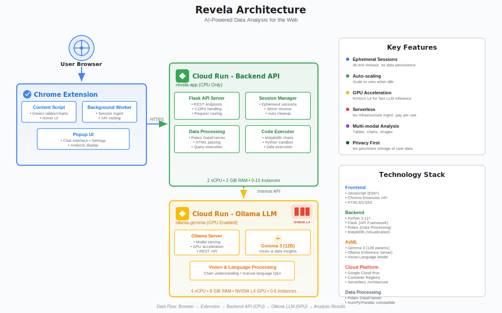

# revela - Data Copilot for the Web

AI-powered data analysis for the web. Analyze tables and charts on any webpage with instant insights and interactive exploration.

## Overview

Revela is a Chrome extension with a cloud-native backend that provides ephemeral, privacy-first AI analysis of data visualizations using Google's Gemma 3 models. Simply hover over any table or chart while browsing to get instant insights or start a conversational analysis.

## How Revela Helps

- **Instant Analysis**: Hover over any table or chart on a webpage to see AI-generated insights
- **Deep Exploration**: Ask questions and perform complex analytics through an interactive chat interface
- **Chart Generation**: Automatically generate visualizations from data using matplotlib
- **Privacy-First**: Ephemeral sessions with no persistent storage of user data
- **Zero Setup**: Works directly in your browser with any public webpage

## Technologies Used

- **Google Cloud Run**: Serverless deployment with auto-scaling (CPU and GPU instances)
- **Gemma 3 12B**: Google's 12B parameter language model for data analysis
- **Ollama**: Local LLM inference server
- **Flask**: Python web framework for API layer
- **Polars**: High-performance DataFrame library for data processing
- **Python**: Backend service implementation
- **JavaScript**: Chrome extension and frontend
- **Chrome Extension API**: Browser integration

## System Components

### 1. Chrome Extension (Frontend)

The browser-side component that:
- Detects analyzable tables and images on web pages
- Displays hover icons beside data elements
- Provides two interaction modes:
  - **Quick Insights**: Instant AI summary
  - **Deep Analyze**: Interactive chat sidebar
- Extracts and sends data to the backend API
- Manages user sessions

### 2. Service Layer (Backend API)

Flask-based API service running on Google Cloud Run (CPU):
- Manages ephemeral analysis sessions (30-minute timeout)
- Processes HTML tables and images
- Orchestrates LLM queries to Ollama service
- Executes Polars-based data queries
- Generates matplotlib charts
- Auto-cleanup of inactive sessions
- **Resources**: 2 vCPU, 2 GiB RAM, scales 0-10 instances

### 3. Ollama LLM Container

Inference service running on Google Cloud Run (GPU):
- Hosts Gemma 3 (12B parameter) model
- Handles vision analysis for charts and images
- Processes natural language queries
- GPU-accelerated inference with NVIDIA L4
- **Resources**: 4 vCPU, 8 GiB RAM, 1x NVIDIA L4 GPU, scales 0-5 instances

## Architecture



The architecture consists of three main components:

1. **Chrome Extension** - Browser-side detection and UI for seamless integration with any webpage
2. **Backend API (Cloud Run - CPU)** - Flask service handling session management, data processing with Polars, and code execution
3. **Ollama LLM (Cloud Run - GPU)** - GPU-accelerated inference with Gemma 3 for vision and language analysis

### Cloud Run Advantages

- **Auto-scaling**: Scales to zero when idle, reducing costs
- **Serverless**: No infrastructure management required
- **GPU Support**: Native support for GPU-accelerated inference
- **Source Deployment**: Deploy directly from source code
- **Service Authentication**: Built-in IAM for secure service-to-service communication

## Use Cases

### 1. Quick Data Exploration

Hover over a table on Wikipedia, financial sites, or research papers to instantly understand trends, outliers, and key statistics without leaving the page.

### 2. Comparative Analysis

Ask questions like "Which country has the highest GDP?" or "Compare the top 5 values" to get immediate answers with supporting data.

### 3. Chart Generation

Request visualizations directly from table data: "Show me a bar chart of GDP by country" to generate matplotlib charts on demand.

### 4. Image Analysis

Analyze existing charts and visualizations: "What trends does this chart show?" to extract insights from images.

### 5. Complex Analytics

Perform Polars-based queries on web data: "What's the average GDP of Asian countries?" with automatic data filtering and aggregation.

### 6. Educational Research

Students and researchers can quickly analyze data tables in academic papers, online courses, or reference materials.

### 7. Financial Analysis

Analyze stock tables, economic indicators, and financial reports directly from news sites or investor portals.

### 8. Competitive Intelligence

Extract insights from competitor data tables, market research reports, and industry statistics found online.

## Project Setup

### Local Development

#### Prerequisites

- Python 3.11+
- Node.js 16+
- npm
- Chrome browser
- Ollama (for local LLM inference)

#### 1. Backend Setup

```bash
cd revela-app

# Create virtual environment
uv venv .venv

# Activate virtual environment
source .venv/bin/activate  # On macOS/Linux
# or
.venv\Scripts\activate  # On Windows

# Install dependencies
uv sync

# Start the backend
./start-app.sh  # On macOS/Linux
# or
start-app.bat  # On Windows
```

The backend will be available at `http://localhost:8080`

**Environment Variables** (optional):
- `OLLAMA_HOST`: Ollama service URL (default: `http://localhost:11434`)
- `OLLAMA_MODEL`: Model to use (default: `gemma3:12b-it-qat`)
- `ENVIRONMENT`: Set to `production` or `local` (default: `local`)

#### 2. Ollama Setup

**Option A: Local Installation**

```bash
# Install Ollama
curl -fsSL https://ollama.com/install.sh | sh

# Start Ollama
ollama serve

# Pull Gemma model
ollama pull gemma3:12b-it-qat
```

**Option B: Docker**

```bash
cd ollama-gemma
docker build -t revela-ollama .
docker run -p 11434:11434 revela-ollama
```

#### 3. Chrome Extension Setup

```bash
cd chrome-extension

# Install dependencies
npm install

# Build the extension
npm run build
```

**Install Extension:**

1. Download the extension: [revela_chrome_extension.zip](https://github.com/mmohanram13/revela/releases/download/0.0.1/revela_chrome_extension.zip)
2. Extract the zip file
3. Open Chrome and navigate to `chrome://extensions/`
4. Enable "Developer mode" (toggle in top right)
5. Click "Load unpacked"
6. Select the extracted extension folder

## Production Deployment

### Prerequisites

- Google Cloud Platform account
- `gcloud` CLI installed and configured
- Required GCP APIs enabled:
  - Cloud Run API
  - Cloud Build API

### Setup GCP Project

```bash
# Set your project ID
export PROJECT_ID="your-project-id"
gcloud config set project $PROJECT_ID

# Enable required APIs
gcloud services enable run.googleapis.com
gcloud services enable cloudbuild.googleapis.com
```

### Deploy Ollama Service (GPU Instance)

```bash
cd ollama-gemma

gcloud run deploy revela-ollama \
  --source . \
  --region europe-west4 \
  --platform managed \
  --no-allow-unauthenticated \
  --cpu 4 \
  --memory 8Gi \
  --gpu 1 \
  --gpu-type nvidia-l4 \
  --timeout 600 \
  --max-instances 5 \
  --min-instances 0 \
  --concurrency 4

# Get the service URL
export OLLAMA_HOST=$(gcloud run services describe revela-ollama \
  --region europe-west4 \
  --format='value(status.url)')
```

**Note**: GPU instances require quota allocation. Request `NVIDIA L4 GPU` quota under Cloud Run API if needed.

### Deploy Backend Service (CPU Instance)

```bash
cd revela-app

gcloud run deploy revela-app \
  --source . \
  --region europe-west4 \
  --platform managed \
  --allow-unauthenticated \
  --cpu 2 \
  --memory 2Gi \
  --timeout 300 \
  --max-instances 10 \
  --min-instances 0 \
  --concurrency 80 \
  --set-env-vars OLLAMA_HOST=${OLLAMA_HOST}

# Get the backend URL
export BACKEND_URL=$(gcloud run services describe revela-app \
  --region europe-west4 \
  --format='value(status.url)')
```

### Configure Service Authentication

Allow the backend to invoke the Ollama service:

```bash
# Get the backend service account
export BACKEND_SA=$(gcloud run services describe revela-app \
  --region europe-west4 \
  --format='value(spec.template.spec.serviceAccountName)')

# Grant invoke permission
gcloud run services add-iam-policy-binding revela-ollama \
  --region europe-west4 \
  --member="serviceAccount:${BACKEND_SA}" \
  --role="roles/run.invoker"
```

### Deploy Chrome Extension

```bash
cd chrome-extension

# Build for production
npm run build

# The dist/ folder contains the production-ready extension
# Upload to Chrome Web Store or distribute as needed
```

## License

This project is licensed under the MIT License - see the [LICENSE](LICENSE) file for details.
